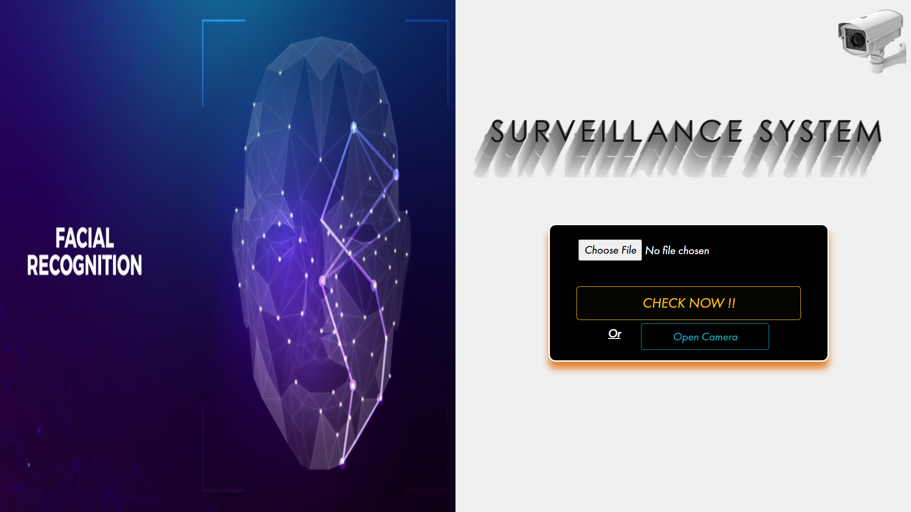
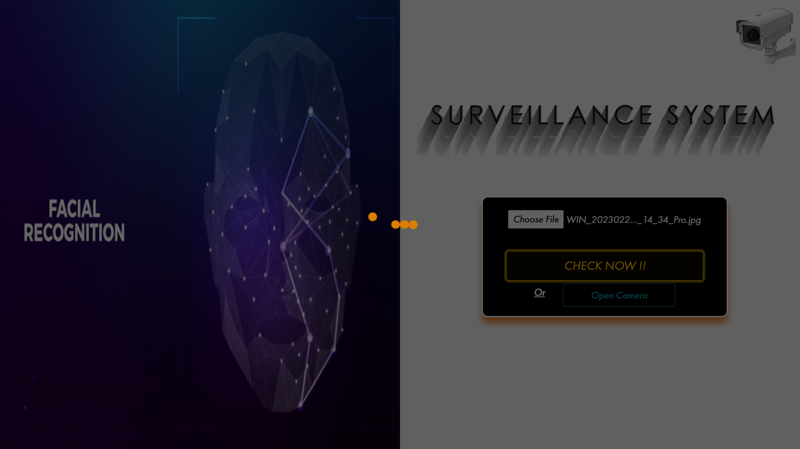
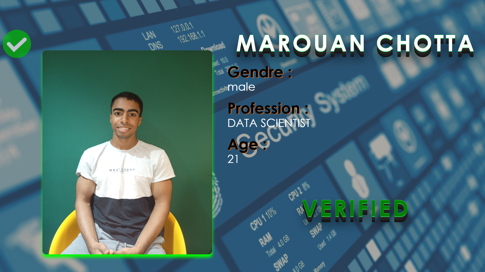

# FaceReco -- Real Time Surveillance System 

## How The App Looks Like

#### Waiting for the model's output

#### There we go, successfully recognized me !



# A Brief History Of What The Project Does 💡
## Overview 🔍
The system performs real-time ***facial recognition*** by extracting unique facial features from a given image using ***Transfer Learning*** with **VGGFace** model, a state-of-the-art deep learning model for facial feature extraction. By **comparing** these extracted features with the existing ones stored in a database of **pre-registered** individuals, The system determines whether the detected person is **recognized** (registered) or not. If recognized, it **retrieves** and **displays** their informations. I also used Kafka and Spark for the data processing hence the expression **" Real Time"**

## Core Workflow 🔄
#### *1. Input Image Capture :*
* You can either choose a pictures from your pc or open your camera and take a new one .
* The input image is hashed and send throught a ***Kafka topic*** which ***Spark listens to*** .
* Flask serves as the backend to handle HTTP requests, process image inputs, and communicate with the model. 

#### *2. Feature Extraction :*
* The VGGFace model (pre-trained on a large facial dataset) is used to extract unique facial features .
* After Spark Consumed the input image from kafka topic, Flask processes the image and passes it to the model for generating a feature vector (embedding), which numerically represents the face. 
* The output of the model (features extracted) is then sent back throught another kafka topic which i configure spring boot app to wait for it's return which is the features obviously.
#### *3. Database Matching :*
* The extracted feature vector is compared ***against existing*** embeddings stored in a CSV database.
* ***Each record*** in the database corresponds to a registered  person  including Their facial feature embedding (pre-calculated and stored), Metadata like name, age, gender, and profession.
* The cosine similarity metric is used to compare the feature vector :
 A high cosine similarity (above a set threshold, e.g., 0.75) indicates a match.
If no match is found, the system labels the individual as unregistered.


## Make It Works For You ✅ 
***1. Make sure*** first you installed Spark ,Kafka :

***Spark (3.5.1)*** ,  ***Kafka (3.7.1)*** : Those versions worked for me

***2. Important !! :*** After you clone the repo, move the Hadoop Directory i have put in this repo , under your 'C:\\' for example .

***3. Add*** Spark, kafka, Hadoop correctly to your environment variables

### Now that you have all set, follow these steps :

* Clone the project

```bash
  git clone https://github.com/Marouansw/FaceReco--RTSS.git
```

* Go to the project directory

```bash
  cd FaceReco--RTSS
```

* Create new python venv 
```bash
  python -m venv venv
```
* Activate it 

```bash
  venv\Scripts\activate
```

* Install requirements.txt
```bash
pip install -r requirements.txt
```

* Go to Model Directory and open the features_model.ipynb in VScode for example, then choose the **venv** as a Kernel to run your code

**-->** Now, the model is **hosted** Locally on port 5000

* Just After this, Open a new Terminal and ***cd to your kafka Directory***, in my case : 
```bash
cd C:\kafka 
```
*  ***Start the Zookeeper*** services :
```bash
bin\windows\zookeeper-server-start.bat config\zookeeper.properties
```
* Open a new Terminal again and cd to your kafka Directory, and ***start Kafka*** services : 
```bash
bin\windows\kafka-server-start.bat config\server.properties
```
* Open a new Terminal and cd to Spark_streaming directory of the repo, it should by something like this : 
```bash
cd C:\Users\LENOVO\Desktop\Master DS\Deep Learning\FaceReco--RTSS\Spark_streaming
```
* ***Lunch Spark_streaming.py***, replace with your python exe, in my case : 
```bash
spark-submit --packages org.apache.spark:spark-sql-kafka-0-10_2.12:3.5.1,org.apache.kafka:kafka-clients:3.5.1 --conf "spark.pyspark.python=C:\Users\LENOVO\AppData\Local\Programs\Python\Python310\python.exe" spark_streaming.py
```
* One more thing left, assuming you already opened the project in vscode, in terminal, **Run Spring boot app** : 
```bash
mvn clean install
``` 
```bash
 mvn spring-boot:run 
 ``` 
## CONGRATS !! THE APP SHOULD BY RUNNING ✔️...


